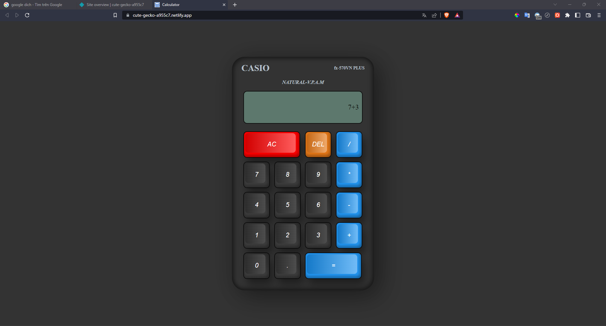

## Available Scripts

Link Demo: [https://cute-gecko-a955c7.netlify.app](https://cute-gecko-a955c7.netlify.app)

In the project directory, you can run:

### `npm start`

Runs the app in the development mode.\
Open [http://localhost:3000](http://localhost:3000) to view it in your browser.

